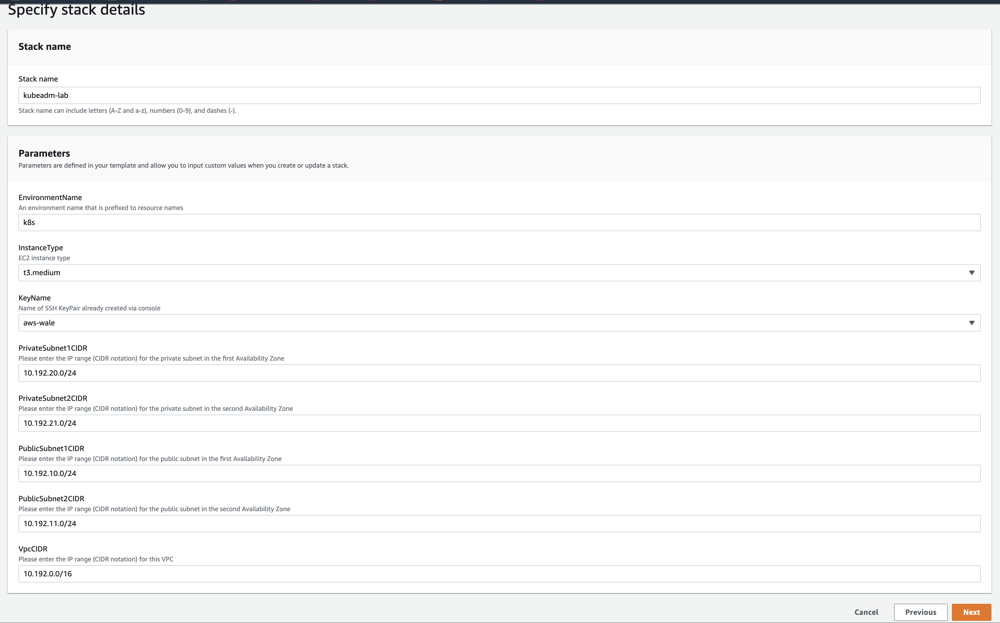

# Kubeadm-lab-on-aws
**Setup Kubernetes Lab on AWS for CKA, CKAD, CKS Exam or Kubernetes Practise**

*This is K8s Lab - CKA, CKAD, and CKS Exam*

# Pre-requisites:
- [AWS CLI](https://docs.aws.amazon.com/cli/latest/userguide/getting-started-install.html) 
- [AWS Account](https://aws.amazon.com/premiumsupport/knowledge-center/create-and-activate-aws-account/)
- [Key Pair](https://docs.aws.amazon.com/AWSEC2/latest/UserGuide/create-key-pairs.html)

# Cluster Details -  4 servers
- 1 control plane
- 2 worker nodes
- 1 Kubectl Client 


# Default Kubernetes v1.25.4. How to specifying a different Kubernetes Release Version

**Update 1.XX.X-00 based on Kubernetes release version in deployments/setup.sh**
**Update 1.XX.X-00 based on Kubernetes release version in deployments/deployment.yml for the Kubectl Client**

## Node Details
- All the provisioned instances run the same OS

```
ubuntu@ip-10-192-10-110:~$ cat /etc/os-release 
NAME="Ubuntu"
VERSION="20.04.4 LTS (Focal Fossa)"
ID=ubuntu
ID_LIKE=debian
PRETTY_NAME="Ubuntu 20.04.4 LTS"
VERSION_ID="20.04"
HOME_URL="https://www.ubuntu.com/"
SUPPORT_URL="https://help.ubuntu.com/"
BUG_REPORT_URL="https://bugs.launchpad.net/ubuntu/"
PRIVACY_POLICY_URL="https://www.ubuntu.com/legal/terms-and-policies/privacy-policy"
VERSION_CODENAME=focal
UBUNTU_CODENAME=focal

```
# Usage Instructions

## A. Deploying the Infrastructure with CloudFormation from AWS Console
- Clone the repo
- Goto AWS Console > Choose Region (e.g. eu-west-1) > CloudFormation > Create Stack
- Use the CF Yaml template in *infrastructure/k8s_aws_instances.yml*
- See image below:

 


## B. Deploying the Infrastructure with CloudFormation from AWS CLI 
```
git clone repo

cd kubeadm-lab-on-aws

# Define your environment variables e.g
REGION=eu-west-1
key_pair=myec2key

# create the infrastructure for your stack
aws cloudformation create-stack --stack-name kubeadm-lab --template-body file://infrastructure/k8s_aws_instances.yml --parameters ParameterKey=EnvironmentName,ParameterValue=k8s ParameterKey=KeyName,ParameterValue=${key_pair} --capabilities CAPABILITY_IAM --region ${REGION}

# Check stack status for CREATE_COMPLETE. Takes about 3mins
aws cloudformation describe-stacks --stack-name kubeadm-lab --query 'Stacks[].StackStatus' --region ${REGION}

```

Note: replace `${key_pair}`  with your key pair already created in AWS EC2.


## Accessing the EC2 instances
- Define your global variables
```
export LOCAL_SSH_KEY_FILE="~/.ssh/key.pem"
export REGION="eu-west-1"
```

## Setting up for deployments
- Confirm the instances created and the Public IP of the Ansible controller server

```
aws ec2 describe-instances --filters "Name=tag:project,Values=k8s-kubeadm" "Name=instance-state-name,Values=running" --query 'Reservations[*].Instances[*].[Placement.AvailabilityZone, State.Name, InstanceId, PrivateIpAddress, PublicIpAddress, [Tags[?Key==`Name`].Value] [0][0]]' --output text --region ${REGION}

```
- Define your Ansible server environment variable

```
export ANSIBLE_SERVER_PUBLIC_IP="$(aws ec2 describe-instances --filters "Name=tag-value,Values=ansible_controller_kubeadm_lab" "Name=instance-state-name,Values=running" --query 'Reservations[*].Instances[*].[PublicIpAddress]' --output text --region ${REGION} --profile default)"
```
Change your AWS credential if different from default.

- Transfer your SSH key to the Ansible Server. This will be need in the Ansible Inventory file.
  
```
echo "scp -i ${LOCAL_SSH_KEY_FILE} ${LOCAL_SSH_KEY_FILE} ubuntu@${ANSIBLE_SERVER_PUBLIC_IP}:~/.ssh/" 

```
Inspect and execute the output generated.

- To Create inventory file. Edit the inventory.sh and update the variable SSH_KEY_FILE and REGION accordingly

View the inventory file and update it according to your AWS environment setup
```
vi deployments/inventory.sh
```

Proceed with the commands below:
```
chmod +x deployments/inventory.sh

bash deployments/inventory.sh

```

- Transfer all playbooks in deployments/playbooks to the ansible server

```
cd deployments

scp -i ${LOCAL_SSH_KEY_FILE} deployment.yml setup.sh ../inventory *.cfg ubuntu@${ANSIBLE_SERVER_PUBLIC_IP}:~

```

- Connect to the Ansible Server
```
ssh -i ${LOCAL_SSH_KEY_FILE} ubuntu@${ANSIBLE_SERVER_PUBLIC_IP}

chmod 400 ~/.ssh/key.pem  # your ssh key copied to the Ansible server
```


- After building the inventory file, test if all hosts are reachable

1.  list all hosts to confirm that the inventory file is properly configured

```
ansible all --list-hosts -i inventory

  hosts (5):
    controller1
    worker1
    worker2

```

2.  Test ping on all the hosts

```
ansible -i inventory k8s -m ping 

```

# Deploy with Ansible

```

ansible-playbook -i inventory -v deployment.yml

```

## Final Result

```
TASK [Ansible Host Kubectl Commands] **************************************************************************************************************************************************
ok: [localhost] => {
    "msg": [
        "NAME             STATUS   ROLES           AGE   VERSION",
        "k8s-controller   Ready    control-plane   40m   v1.25.4",
        "k8s-worker1      Ready    <none>          38m   v1.25.4",
        "k8s-worker2      Ready    <none>          38m   v1.25.4"
    ]
}

PLAY RECAP ****************************************************************************************************************************************************************************
localhost                  : ok=8    changed=4    unreachable=0    failed=0    skipped=0    rescued=0    ignored=0   
```

# Test Kubectl Commands
```
ubuntu@ip-10-192-10-160:~$ kubectl get nodes
NAME             STATUS   ROLES           AGE   VERSION
k8s-controller   Ready    control-plane   40m   v1.25.4
k8s-worker1      Ready    <none>          38m   v1.25.4
k8s-worker2      Ready    <none>          38m   v1.25.4
ubuntu@ip-10-192-10-160:~$ 
```


# Clean Up

*Delete the AWS CloudFormation Stack*

>`aws cloudformation delete-stack --stack-name kubeadm-lab`


*Check if the AWS CloudFormation Stack still exist to confirm deletion* 

>```aws cloudformation list-stacks --stack-status-filter DELETE_COMPLETE --region ${REGION} --query 'StackSummaries[*].{Name:StackName,Date:CreationTime,Status:StackStatus}' --output text | grep kubeadm```

